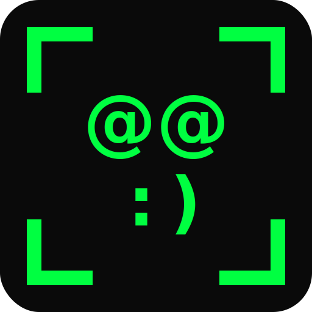

<p align="center">
  
</p>

# Virtual ASCII

A Rust application that converts a real webcam feed into ASCII art and outputs it as a virtual webcam via v4l2loopback. Available as both a CLI and a native GUI. The result is a recognizable but stylized video stream that works in any video calling app (Zoom, Google Meet, Discord, OBS, etc.).

## Getting Started

These instructions will get you a copy of the project up and running on your local machine.

### Prerequisites

- **Rust** (1.70+) - Install via [rustup](https://rustup.rs/)
- **v4l2loopback** - Kernel module for virtual webcam devices
- **A webcam** - Any UVC-compatible USB webcam
- **Linux** - This project uses V4L2, which is Linux-only

Install v4l2loopback:

```bash
# Arch Linux
sudo pacman -S v4l2loopback-dkms

# Ubuntu/Debian
sudo apt install v4l2loopback-dkms

# Fedora
sudo dnf install v4l2loopback
```

### Installing

Clone and build the project:

```bash
git clone https://github.com/kymotsujason/virtual-ascii.git
cd virtual-ascii

# CLI only (minimal dependencies)
cargo build --release

# With GUI
cargo build --release --features gui
```

The binary will be at `target/release/virtual-ascii`.

### Quick Start

1. Load the v4l2loopback kernel module to create a virtual webcam device:

```bash
sudo modprobe v4l2loopback devices=1 video_nr=20 exclusive_caps=1 card_label="Virtual ASCII"
```

2. Run virtual-ascii:

```bash
cargo run --release
```

3. Open your video calling app and select "Virtual ASCII" as the camera source. Or preview with ffplay:

```bash
ffplay /dev/video20
```

## GUI Mode

Build with the `gui` feature and launch:

```bash
cargo run --release --features gui -- gui
```

The GUI provides a native desktop window with:

- **Dual live preview.** Raw camera feed and ASCII output side by side.
- **Settings panel.** Camera selection, resolution, FPS, theme, definition, colors, brightness curve, and invert toggle.
- **Real-time adjustments.** All settings update the live preview immediately (150ms debounce).
- **v4l2loopback management.** Load/unload the kernel module and start/stop the virtual camera, all from the GUI.
- **Camera conflict detection.** Warns if another process (browser, OBS, etc.) is holding the camera.

The GUI uses the same pipeline as the CLI, so the same themes, definition levels, and brightness curves apply.

## CLI Usage

```
virtual-ascii [OPTIONS]              # run (default)
virtual-ascii set [OPTIONS]          # change settings on a running instance
virtual-ascii status                 # query current settings
```

### Options

| Flag | Description | Default |
|------|-------------|---------|
| `-d, --definition <1-10>` | Detail level (1=blocky, 10=ultra-fine) | `5` |
| `-t, --theme <NAME>` | Color theme | `green` |
| `-f, --fps <N>` | Target frames per second | `30` |
| `-r, --resolution <WxH>` | Camera resolution (e.g. `1920x1080`) | auto (highest) |
| `-i, --camera-index <N>` | Webcam device index | auto-detected |
| `-o, --output-device <PATH>` | V4L2 loopback device path | `/dev/video20` |
| `--fg-color <HEX>` | Override foreground color | (from theme) |
| `--bg-color <HEX>` | Override background color | (from theme) |
| `-c, --brightness-curve <NAME>` | Brightness mapping curve | `linear` |
| `--invert` | Invert brightness mapping | `false` |

### Themes

| Theme | Foreground | Background | Vibe |
|-------|-----------|------------|------|
| `mono` | White | Black | Classic terminal |
| `green` | Green | Near-black | Default, retro |
| `amber` | Amber | Dark brown | Vintage CRT |
| `blue` | Light blue | Dark blue | Cool/calm |
| `matrix` | Green | Black | The Matrix |
| `vaporwave` | Pink/magenta | Dark purple | Aesthetic |
| `fire` | Orange | Dark red | Warm/intense |
| `color` | Webcam colors | Black | Natural/photographic |

Custom colors override the theme:

```bash
virtual-ascii -t mono --fg-color ff00ff --bg-color 001100
```

### Definition Levels

| Level | Columns | Character Set | Use Case |
|-------|---------|---------------|----------|
| 1 | 40 | 4 chars | Very blocky, abstract |
| 2-3 | 50-60 | 7-10 chars | Chunky, stylized |
| 4-5 | 70-80 | 12-15 chars | Balanced (default) |
| 6-7 | 100-120 | 18-70 chars | Detailed |
| 8-10 | 140-200 | 70 chars | Ultra-fine, almost photographic |

### Brightness Curves

- `linear` - Direct mapping (default, good for most lighting)
- `exponential` - Emphasizes dark areas, compresses highlights
- `sigmoid` - S-curve, enhances midtone contrast

### Examples

```bash
# Classic green terminal look
virtual-ascii -t green -d 5

# Ultra-fine Matrix style at 60fps
virtual-ascii -t matrix -d 9 -f 60

# Blocky retro CRT
virtual-ascii -t amber -d 2 -c sigmoid

# Custom vaporwave colors
virtual-ascii --fg-color ff69b4 --bg-color 0a0020 -d 6

# Natural color ASCII art
virtual-ascii -t color -d 7

# High contrast inverted
virtual-ascii -t mono -d 5 --invert
```

### Live Settings

While virtual-ascii is running, you can change any setting without restarting. This keeps your virtual webcam stream uninterrupted, so video calling apps (Zoom, OBS, etc.) won't lose the source.

```bash
# Check what's currently running
virtual-ascii status

# Change theme
virtual-ascii set -t amber

# Change camera and resolution in one command (single camera reopen)
virtual-ascii set -i 2 -r 1920x1080

# Change multiple render settings at once (single renderer rebuild)
virtual-ascii set -d 8 -t vaporwave --brightness-curve sigmoid

# Change FPS
virtual-ascii set -f 60

# Change colors
virtual-ascii set --fg-color ff69b4 --bg-color 0a0020

# Invert brightness
virtual-ascii set --invert true
```

The `set` command accepts the same flags as the main command. Multiple settings in one command are batched, so `-i 2 -r 1920x1080` reopens the camera only once, not twice.

Communication uses a Linux abstract namespace socket, so there are no stale socket files to clean up, even after `kill -9`.

## Insta360 Link 2

The Insta360 Link 2 works out of the box with virtual-ascii. It presents as a standard UVC device at `/dev/video0`.

### Device Info

```
Card type:  Insta360 Link 2: Insta360 Link
Driver:     uvcvideo
Formats:    MJPG, H.264
```

### Supported Resolutions

| Resolution | Aspect | Max FPS | Notes |
|-----------|--------|---------|-------|
| 3840x2160 | 16:9 | 30 | 4K, highest quality but heavy |
| 1920x1440 | 4:3 | 60 | Camera default, tall aspect |
| 1920x1080 | 16:9 | 60 | Standard 1080p, recommended |
| 1280x960 | 4:3 | 60 | Lower res 4:3 |
| 1280x720 | 16:9 | 60 | 720p, lightest load |
| 1088x1920 | 9:16 | 60 | Portrait mode |

### Recommended Settings

The camera defaults to 1920x1440 (4:3) with `AbsoluteHighestFrameRate`, which may produce a taller-than-expected output. This works fine. The ASCII grid adapts to whatever the camera provides.

```bash
# Standard use (camera auto-detected)
virtual-ascii -t green -d 5

# If your Insta360 isn't at index 0, find it:
v4l2-ctl --list-devices
# Then specify the index:
virtual-ascii -i 0

# Force 1080p 16:9 for a standard aspect ratio
virtual-ascii -r 1920x1080

# For lighter CPU usage, use 720p
virtual-ascii -r 1280x720

# The default 4:3 aspect ratio (1920x1440) works well with ASCII art.
# The taller frame gives more vertical character rows for better detail.

# Change resolution on a running instance
virtual-ascii set -r 1280x720
```

### Troubleshooting

If the camera isn't detected:

```bash
# Check the device is connected
ls /dev/video*

# Check device details
v4l2-ctl --device=/dev/video0 --all

# Ensure your user has video group access
groups | grep video
# If not:
sudo usermod -aG video $USER
# Then log out and back in
```

## Running the Tests

```bash
cargo test
```

Tests cover the glyph cache (font rasterization) and renderer (grayscale conversion, downsampling, compositing).

## Architecture

The application uses a 3-thread pipeline with bounded crossbeam channels. The CLI adds a control socket for live settings, while the GUI drives the pipeline directly via crossbeam commands:

```
CLI mode:
  [set/status CLI] ──abstract socket──> [Control Thread]
                                             │
                              ┌──────────────┼──────────────┐
                              ▼              ▼              │
  Capture Thread ──bounded(2)──> Render Thread ──bounded(2)──> Output Thread
    (nokhwa)                      (CPU-bound)                   (v4l2 write)

GUI mode:
  [egui window] ──crossbeam cmds──> Capture Thread ──> Render Thread ──> Output Thread
       ▲                                 │                  │
       └─── preview channels (bounded 1) ┘──────────────────┘
```

- **Capture** grabs frames from the webcam via nokhwa (decodes MJPEG to RGB)
- **Render** converts RGB frames to ASCII art (grayscale, downsample, character map, glyph composite)
- **Output** writes rendered RGB frames to the v4l2loopback device
- **Control** (CLI) listens on a Unix abstract socket for `set`/`status` commands, routes changes to the appropriate thread
- **GUI** sends `CaptureCommand`/`RenderCommand` directly over crossbeam channels, with preview frames flowing back to the UI thread for display

Frames are dropped (not queued) when the render thread falls behind, keeping latency low. All font glyphs are pre-rasterized at startup, so per-frame rendering is bitmap copies only. Command processing uses `try_recv()` at the top of each frame loop (~40-100ns when empty), so there's no overhead on the hot path.

## Built With

* [nokhwa](https://crates.io/crates/nokhwa) - Webcam capture
* [fontdue](https://crates.io/crates/fontdue) - Font rasterization
* [crossbeam-channel](https://crates.io/crates/crossbeam-channel) - Thread communication
* [nix](https://crates.io/crates/nix) - V4L2 ioctl bindings
* [clap](https://crates.io/crates/clap) - CLI argument parsing
* [egui](https://crates.io/crates/egui) / [eframe](https://crates.io/crates/eframe) - GUI (optional, glow backend)

## Authors

* **Jason Yue** - *Initial work* - [kymotsujason](https://github.com/kymotsujason)

## License

This project is licensed under the MIT License - see the [LICENSE.md](LICENSE.md) file for details.

The embedded font (Source Code Pro) is licensed under the [SIL Open Font License](https://scripts.sil.org/OFL).
